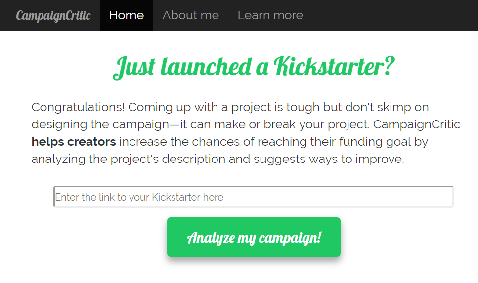

# CampaignCritic

## What is CampaignCritic?
A web app that helps Kickstarter creators increase their chances of reaching their campaign's funding goal by analyzing the project description, its structure and content.

## How do you use CampaignCritic?
If you've recently launched a Kickstarter, visit the [app](http://campaigncritic.com/) and add the URL to your project. If you're still drafting your campaign, the preview URL should work too. After you submit your project link, you'll receive 3 insights:
- The probability that your project will reach its funding goal
- How to improve your chances by tweaking 6 structural components in your project's description
- How to improve your chances by adding specific language or topics that are highly predictive of successfully funded projects

I hope you'll enjoy using CampaignCritic as much as I enjoyed building it!

## How does CampaignCritic work?
When you submit a link to your Kickstarter project, CampaignCritic:
1. Analyzes the structure and content of your project's description using natural language processing
2. Feeds the analysis into a machine learning model that has learned from having combed through over 24,000 past Kickstarters
3. Reports the probability of reaching your funding goal based on the structure and content of your project's description
4. Computes weighted scores reflecting how effectively your campaign utilizes 6 structural components that were found to be most predictive of funded projects
5. Compares your project's scores against the top 5% of projects from the past five years

CampaignCritic is only relevant for Kickstarters in the USA and doesn't take into account a project's aesthetics, feasiblility, usefulness, market demand or media buzz—just some aspects of a project's description that are relatively easy for creators to tweak. The results are accurate 71% of the time. For those still curious about how I built CampaignCritic, check out these [slides](https://docs.google.com/presentation/d/e/2PACX-1vQtciH4cJu_f81dpL2XCjvI-39WRlAomIqf2dfXUNlgI1wGre2Qj_e-tBWVR5GShQeFeFQL_idfM4Nj/pub?start=false&loop=false&delayms=3000)

## Why did I build CampaignCritic?
- I want to help Kickstarter creators maximize their chances of reaching their funding goal. Too many innovative projects are crippled by a lackluster project description.
- I'm a big fan of the crowdfunding world&mdash;it enables everyday folks to become entrepreneurs and sometimes even gives rise to a revolutionary new genre of [products](https://www.pebble.com/).
- I love natural language processing and want to use it to build tools that enable machines to decode and interpret the most unstructured data of all&mdash;human language. By doing so, perhaps we'll someday teach a machine to help design Kickstarter campaigns, or even business plans for new companies.

## What does this repo include?
- Jupyter notebooks written in Python that illustrate every aspect of my building this project with complete documentation. Each notebook can be run to generate the data and content needed for the subsquent notebook.
   1. [Parsing the Web robots database](https://github.com/redwanhuq/campaign-critic/blob/master/0_parsing_web_robots_database.ipynb)
   2. [Scraping Kickstarter project pages](https://github.com/redwanhuq/campaign-critic/blob/master/1_scraping_kickstarter_projects.ipynb)
   3. [Engineering meta features and building a training set](https://github.com/redwanhuq/campaign-critic/blob/master/2_building_training_set.ipynb)
   4. [Uploading data into PostgreSQL](https://github.com/redwanhuq/campaign-critic/blob/master/3_postgres_uploader.ipynb)
   5. [Exploring the meta feature space](https://github.com/redwanhuq/campaign-critic/blob/master/4_exploring_meta_feature_space.ipynb)
   6. [Training a model](https://github.com/redwanhuq/campaign-critic/blob/master/5_training_models.ipynb)
   7. [Suggesting how a project can be improved](https://github.com/redwanhuq/campaign-critic/blob/master/6_building_suggestions_graph.ipynb)
- Jupyter notebooks used to research and prototype (found in the [prototyping](https://github.com/redwanhuq/campaign-critic/tree/master/prototyping) folder and fully documented) the following:
   1. [Scraping and extracting content from a Kickstarter project page](https://github.com/redwanhuq/campaign-critic/blob/master/prototyping/prototyping-scraping_and_parsing.ipynb)
   2. [Engineering meta features for a Kickstarter project](https://github.com/redwanhuq/campaign-critic/blob/master/prototyping/prototyping-feature_engineering.ipynb)
   3. [Developing a machine learning strategy](https://github.com/redwanhuq/campaign-critic/blob/master/prototyping/prototyping-machine_learning.ipynb)
- Web app based on Bootstrap (front-end) and Flask (back-end), containing the trained model, scaler, and vectorizer (found in the [application](https://github.com/redwanhuq/campaign-critic/tree/master/application) folder).
- Two Python modules used by the Jupyter notebooks in this repo
   1. `feature_engineering.py` contains all functions used for engineering meta features
   2. `prediction_results.py` contains all functions used for constructing the suggestions bar graph

## Summary and what's next
I designed CampaignCritic to help Kickstarter creators that are struggling with writing their project description, as well as creators who just want to maximize their chances. However, my hope is that by using CampaignCritic, creators will develop better project descriptions that are more convincing, thus enabling a richer crowdfunding scene and perhaps, more frequent innovations from everyday folks. Given more time, I'd incorporate the funding goal, the pledge structure, image quality and text content inside images in the feature space to improve the model's performance and provide additional knobs that creator's could turn to tweak their projects and increase their chances.
